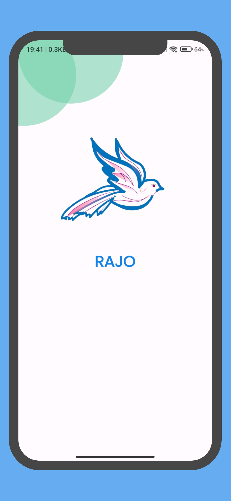
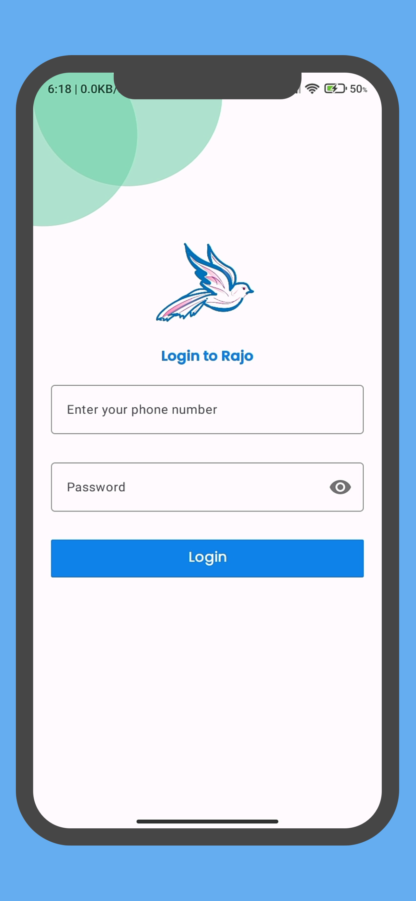
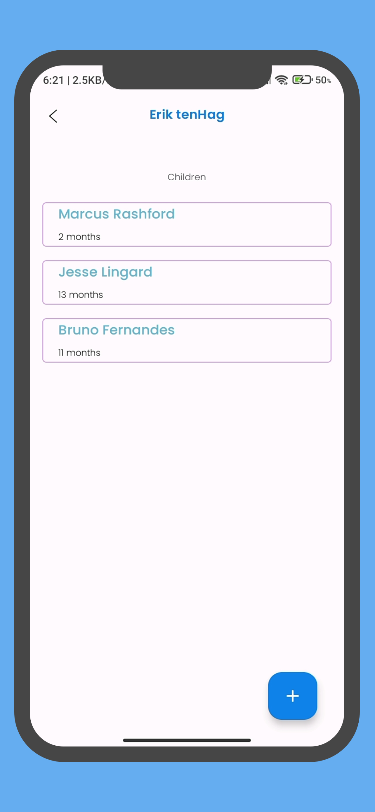
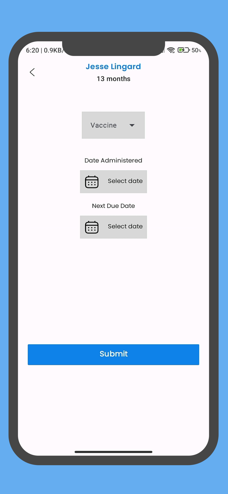
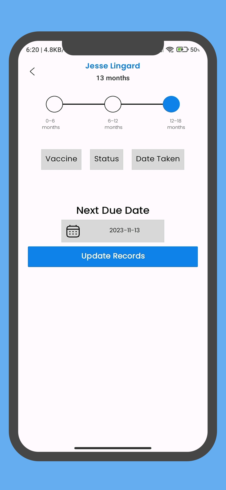

# Rajo

Warsan project that tracks immunization records.

**Nuts and bolts:**

- Kotlin
- XML
- Object oriented programming
- Recyclerview
- Viewpager
- Material design
- Single activity architecture with the navigation component
- Safe arguments for fragment communication
- 'CRUD' operations by making `GET`, `POST` and `PUT` requests to a REST API

**Screenshots:**
<p allign="center">





</p>

**Getting Started:**

1. Clone the repository.

```bash
git clone https://github.com/slowburn-404/warsan.git
```

2. Configure dependencies in your app level ```build.gradle``` file.

```kotlin
// Retrofit
    implementation("com.squareup.retrofit2:retrofit:2.9.0")
    implementation("com.squareup.retrofit2:converter-gson:2.9.0")
//okhttp
    implementation("com.squareup.okhttp3:okhttp:4.9.1")
    implementation("com.squareup.okhttp3:logging-interceptor:4.9.1")
```

3. Build and run on Android Studio on a virtual or physical device.

**Dependencies:**

- Retrofit, OkHttp.

**Contribute:**

- Open issues, submit pull requests, or share your feedback.
